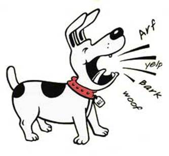

# Example: EAST, Tesseract and Typing

This example contains one image document which points to this image:



In addition, there are three views, one created by EAST, one by Tesseract and one by a semantic typing component. We now give fragments of the four relevant parts of the MMIF file, each with some comments.

To see the full example scroll down to the end or open the [raw json file](raw.json).

### Fragment 1: the documents list

```json
{
  "documents": [
    {
      "@type": "http://mmif.clams.ai/0.4.0/vocabulary/ImageDocument",
      "properties": {
        "id": "m1",
        "mime": "image/jpg",
        "location": "/var/archive/image-fido-barks.jpg" }
    }
  ]
}
```
This is simply just a list with one *ImageDocument* which points at the file with the barking dog image.

### Fragment 2: the EAST view

Here are the metadata in this view:

```json
{
  "app": "http://mmif.clams.ai/apps/east/0.2.1",
  "contains": {
    "http://mmif.clams.ai/0.4.0/BoundingBox": {
      "timeUnit": "pixels",
      "document": "m1" } }
}
```

It simply says that EAST created the view and that all bounding box annotations are over document "m1" using pixels as the unit.

And here is the annotations list:


```json
[
  {
    "@type": "http://mmif.clams.ai/0.4.0/vocabulary/BoundingBox",
    "properties": {
      "id": "bb1",
      "coordinates": [[10,20], [40,20], [10,30], [40,30]],
      "boxType": "text" }
  },
  {
    "@type": "http://mmif.clams.ai/0.4.0/vocabulary/BoundingBox",
    "properties": {
      "id": "bb2",
      "coordinates": [[210,220], [240,220], [210,230], [240,230]],
      "boxType": "text" }
  }
]
```

EAST has found two text boxes: one for "Arf" and one for "yelp" (although after EAST runs we do not know yet what the actual text is). Text boxes are encoded simply by specifying what the type of the bounding box is. For the sake of a somewhat smaller example file we are assuming here that EAST does not find text boxes when the text slants down. Note also that the coordinates are made up and bear little relation to what the real coordinates are.

### Fragment 3: the Tesseract view

Metadata:

```json
{
  "app": "http://mmif.clams.ai/apps/tesseract/0.2.1",
  "contains": {
    "http://mmif.clams.ai/0.1.0/vocabulary/TextDocument": {},
    "http://mmif.clams.ai/0.1.0/vocabulary/Alignment": {} }
}
```

Tesseract creates text documents from bounding boxes with type equal to "text" and creates alignment relations between the documents and the boxes. The interesting thing here is compared to the metadata for the view created by EAST is that here no *document* metadata property is defined. This is because neither *TextDocument* nor *Alignment* need to be directly anchored into a document.

Annotations list:

```json
[
  { 
    "@type": "http://mmif.clams.ai/0.1.0/vocabulary/TextDocument",
    "properties": {
      "id": "td1",
      "text": {
        "@value": "Arf" } }
  },
  {
    "@type": "http://mmif.clams.ai/0.1.0/vocabulary/Alignment",
    "properties": {
      "id": "a1",
      "source": "v1:bb1",
      "target": "td1" }
  },
  { 
    "@type": "http://mmif.clams.ai/0.4.0/vocabulary/TextDocument",
    "properties": {
      "id": "td2",
      "text": {
        "@value": "yelp" } }
  },
  {
    "@type": "http://mmif.clams.ai/0.4.0/vocabulary/Alignment",
    "properties": {
      "id": "a2",
      "source": "v1:bb2",
      "target": "td2" }
  }
]
```

The text documents just have identifiers and store the text, they themselves are not aware of where they came from. The alignments link the text documents to bounding boxes in the view created by EAST.

### Fragment 4: the Semantic Typer view

Metadata:

```json
{
	"app": "http://mmif.clams.ai/apps/semantic-typer/0.2.4",
	"contains": {
		"http://mmif.clams.ai/0.4.0/vocabulary/vocabulary/SemanticTag": {} },
}

```

Nothing spectacular here. Like the previous view no *document* property is used, but in this case it is because the semantic tags in the annotation list each refer to a different document.

Annotations list:

```json
[
	{ 
		"@type": "http://mmif.clams.ai/0.4.0/vocabulary/SemanticTag",
		"properties": {
			"id": "st1",
			"category": "dog-sound",
			"document": "V2:td1",
			"start": 0,
			"end": 4 }
	},
	{ 
		"@type": "http://mmif.clams.ai/0.4.0/vocabulary/SemanticTag",
		"properties": {
			"id": "st2",
			"category": "dog-sound",
			"document": "V2:td2",
			"start": 0,
			"end": 4 }
	}
]
```

Now each annotation needs to have its own *document* property so we know what documents each semantic tag is anchored to.


## Full MMIF File

```json

```

