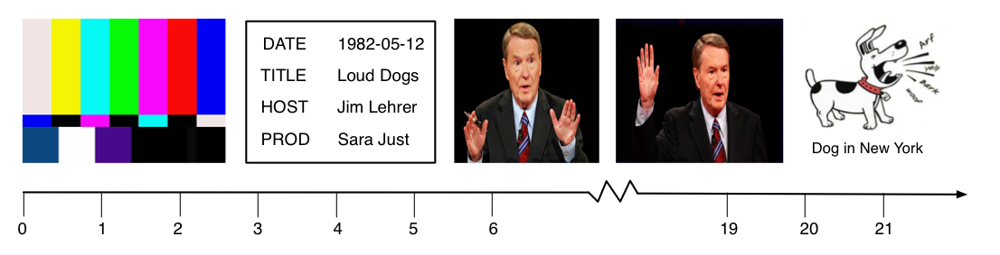

# Example: Everything and the kitchen sink

To see the full example scroll down to the end or open the [raw json file](raw.json).

This is an example with a bunch of different annotations created by a variety of tools. For the input we have  a short totally made up video which starts with some bars-and-tone and a simple slate. Those are followed by about a dozen seconds of a talking head followed by an image of a barking dog.



The timeline includes markers for seconds. In the views below all anchors will be using milliseconds.

We apply the following processing tools:

1. Bars-and-tone extraction
1. Slate extraction
1. Audio segmentation
1. Kaldi speech recognition and alignment
1. EAST text box recognition
1. Tesseract OCR
1. Named entity recognition
1. Slate parsing

Following now are short explanations of some frgaments of the full MMIF file, some application output was explained in more detail in other examples, refer to those for more details.

### Extracting time frames

The first three steps are straightforward and all result in views with time frame annotations (views with id=v1, id=v2 and id=v3). The bars-and-tone and slate extraction applications each find one time frame and the audio segmenter finds two segments with the second one being a speech time frame that starts at about 5500ms from the start.

```json
{
	"@type": "http://mmif.clams.ai/vocabulary/TimeFrame/v5",
	"properties": {
		"id": "tf2",
		"frameType": "speech",
		"start": 5500,
		"end": 22000 }
}
```

This time frame will provide the input to Kaldi.

### Kaldi speech recognition

Kaldi creates one view (with id=v4) which has

- a text document
- an alignment of that document with the speech time frame from the segmenter
- a list of tokens for the document
- a list of time frames corresponding to each token
- a list of alignments between the tokens and the time frames

In the metadata it spells out that the offsets of all tokens are taken to be offsets in "td1", which is a text document in the same view. We can do this instead of the alternative (using the *document* property on all tokens) because all tokens are for the same text document.

```json
{
  "app": "http://mmif.clams.ai/apps/kaldi/0.2.1",
  "contains": {
    "http://mmif.clams.ai/vocabulary/TextDocument/v1": {},
    "http://vocab.lappsgrid.org/Token": {
      "document": "td1" },
    "http://mmif.clams.ai/vocabulary/TimeFrame/v5": {
      "timeUnit": "milliseconds",
      "document": "m1" },
    "http://mmif.clams.ai/vocabulary/Alignment/v1": {}
  }
}
```

Note that a text document can refer to its text by either using the *text* property which contains the text verbatim or by referring to an external file using the *location* property, here we use the second approach:

```json
{
	"@type": "http://mmif.clams.ai/vocabulary/TextDocument/v1",
	"properties": {
		"id": "td1",
		"mime": "text/plain",
		"location": "/var/processed/transcript-002.txt" }
}
```

For the sake of argument we assume perfect speech recognition, and the content of the external file is as follows.

>  Hello, this is Jim Lehrer with the NewsHour on PBS. In the nineteen eighties, barking dogs have increasingly become a problem in urban areas.

This text is aligned with the second time frame from the segmenter.

```json
{
	"@type": "http://mmif.clams.ai/vocabulary/Alignment/v1",
	"properties": {
		"id": "a1",
		"source": "v3:tf2",
		"target": "td1" }
}
```

See the full example below for all the tokens, time frames for each token and the alignment between the token and the time frame.

### EAST and Tesseract

EAST adds bounding boxes anchored to the video document with id=m1:

```json
{
  "app": "http://mmif.clams.ai/apps/east/0.2.1",
  "contains": {
    "http://mmif.clams.ai/1.0.4/BoundingBox": { "document": "m1" }
}
```

Let's assume that EAST runs on frames sampled from the video at 1 second intervals. For our example that means that EAST finds boxes at time offsets 3, 4, 5 and 21 seconds. Let's assume decent performance where EAST finds all the boxes in the slate and just the caption in the image (but not the barking sounds). Here is one example box annotation:

```json
{
  "@type": "http://mmif.clams.ai/vocabulary/BoundingBox/v4",
  "properties": {
    "id": "bb9",
    "timePoint": 4000,
    "coordinates": [[180, 110], [460, 110], [180, 170], [460, 170]],
    "label": "text" }
}
```

Due to the nature of the input many of the bounding boxes will have identical or near-identical coordinates. For example, there are two more bounding boxes with the coordinates above, one for the box with time offset 3000 and one for the box with time offset 5000.

Tesseract now runs on all those boxes and creates a text document for each of them. In doing so, it will add these to a new view: 
* text documents from each text box
* alignment of that documents to their originating boxes

Thus, the metadata of the new view would be:


```json
{
  "app": "http://mmif.clams.ai/apps/tesseract/0.4.4",
  "contains": {
    "http://mmif.clams.ai/vocabulary/TextDocument/v1": {},
    "http://mmif.clams.ai/vocabulary/Alignment/v1": {
      "sourceType": "http://mmif.clams.ai/vocabulary/TextDocument/v1", 
      "targetType": "http://mmif.clams.ai/vocabulary/BoundingBox/v4"
    }
  }
}
```

Unlike the alignment annotations in the Kaldi view, Tesseract specifies types of both ends of the alignments in the `contains` metadata. This is only allowed because all alignment annotations in the view have the same source type and target types. This information can help, for example, machines search for certain alignments more quickly.
{: .box-note}

Now the recognition results are recorded as text documents, here's one:

```json
{
  "@type": "http://mmif.clams.ai/vocabulary/TextDocument/v1",
  "properties": {
    "id": "td1",
    "text": { "@value": "DATE" } }
}
```

And here is the corresponding alignment from the bounding box to the text document:

```json
{
  "@type": "http://mmif.clams.ai/vocabulary/Alignment/v1",
  "properties": {
    "id": "a1",
    "source": "v5:bb1",
    "target": "td1" }
}
```

The source is in another view, hence the prefix on the identifier.

### Named entity recognition

After Kaldi and Tesseract have added text documents we now have all text extracted from audiovisual elements and we can run NLP tools like named entity recognizers over them. Each entity annotation refers to a text document, either the one in the Kaldi view or one of the documents in the Tesseract view, this examples refers to one of the documents in the Tesseract view:

```json
{
  "@type": "http://vocab.lappsgrid.org/NamedEntity",
  "properties": {
    "id": "ne1",
    "document": "v6:td2",
    "start": 0,
    "end": 10,
    "category": "Date",
    "text": "1982-05-12" }
}
```

Note that since there were three text boxes with the date and therefore three documents with the actual text, there are also three named entities for this date.

### Slate parsing

This section is somewhat speculative since we have not yet made any decisions on what the output of a slate paser will look like.

Slate parsing applies to frames in the slate segment found in the slate view (id=v2) and uses several kinds of information obtained from two or three other views:

- The EAST view has text bounding boxes with coordinates for all those boxes.
- The Tesseract view has the text values for all those boxes.
- The NER view has named entity classes for some of those text values, which may in some cases be useful for slate parsing.

A minimal option for the slate parser is to create a particular semantic tag dat describes value fields in a slate. For that it may use the the category of the named entity that is anchored to the field or the text in adjacent field. For example, if we have the text "1982-05-12" and we know it was tagged as a *Date* then this may indicate that that value is the air time of the video. Similary, if that value occurs next to a text that has the text "DATE" in it we may also derive that the value was a *Date*.

Here is the tag annotation on the same document as the named entity annotation above: 

```json
{
  "@type": "http://vocab.lappsgrid.org/SemanticTag",
  "properties": {
    "id": "st1",
    "document": "v6:td2",
    "start": 0,
    "end": 10,
    "tagName": "Date",
    "text": "1982-05-12" }
}
```

Note that the *tagName* property has the same value as the *category* property on the named entity. This is a coincidence in that there is a named entity category *Date* as well as a slate category *Date*.

Similar to what we saw for the named entities, there will be multiple versions of this data tag due to multiple text boxes with the same text.


## Full MMIF File

```json

```


