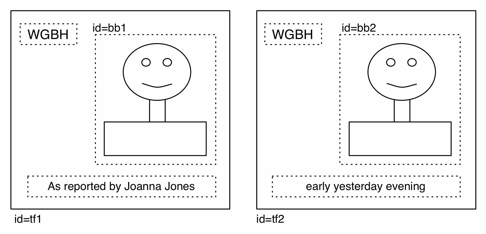
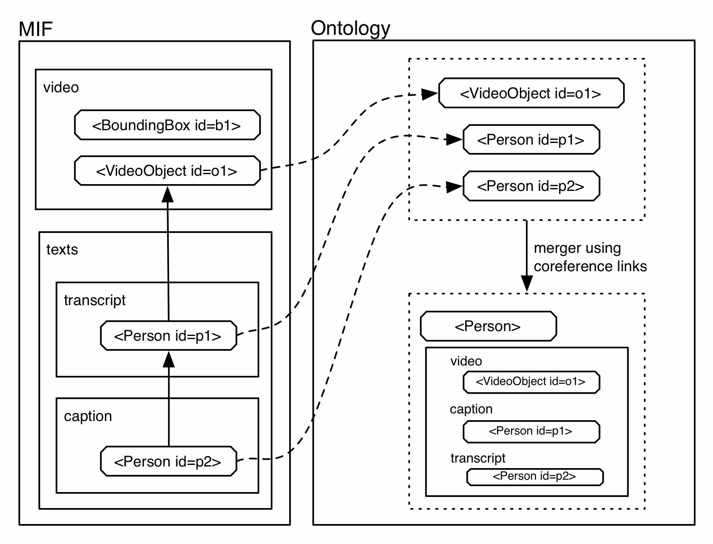

# MMIF: annotating video and text

MMIF here stands for an annotation format for audiovisual media as well as associated text (transcript, closed captions and other OCR).

Some top-level requirements for MMIF

- Either extend LIF or play nice with LIF.
- Be able to refer to external files (primary video files are too heavy to carry in MMIF) 
- Be able to refer to time frames and bounding boxes in those files.
- Allow LIF elements to refer to temporal, spatial, or temporospatial objects in the video and vice versa.
- The letters need to stand for something.

After some initial discussion (Keigh and Marc) here is a first sketch of MMIF. While we did not see MMIF as an extension of LIF, we did imagine MMIF being similar in that it uses JSON-LD and some kind of vocabulary (come to think of it, we weren't that specific, this is on me, Marc). This is all a first attempt of course, everything is up for discussion.

There are several components of MMIF 

1. annotation json
1. service metadata json
1. MMIF vocabulary
1. MMIF json schema

And there are several design considerations for the MMIF annotation json:

- Video annotations.
- Text annotations.
- Some way for objects to refer to each other, either by text annotations referring to video annotations and vice versa, or by using an ad hoc mini ontology that text and video annotations can refer to.

## CLAMS service metadata

All services must provide informative metadata to the workflow engine in the use. Such metadata need to include: 

* Tool version, a brief description, and a link to full documentation 
* Vendor and contact information
* Required media and annotations
* Produced media and annotations

In LAPPS project, we couldn't find a neat way to automatically incorporate lapps tool metadata into Galaxy tool metadata (defined in tool xml files). Thus, for technical requirements, in designing CLAMS service metadata schema, these should be taken into consideration: 

* Compatibility with Galaxy tool xml schema
* Implementing a tool to automatically generate Galaxy tool xml from service metadata
* LD-style URI field to encode full documentation of a service (merely link to its codebase repository where a README file can be found)

## MMIF annotations

### annotation metadata
In LIF, the metadata encoded in the annotation file is at the very minimum (mostly jsut empty in fact), hardly gives much helpful information to client tools. For example, LIF doesn't know which version of schema it's encoded with, which version of vocab annotations inside is using. Although each `view` has its own metadata that is basically for `contains` object to tell client applications what types of annotations are included in it, clients have to iterate over entire views to locate specific annotation types. We want to keep a meaningful top-level metadata in MMIF, so that clients (possibly including the workflow engine) can *sniff* the file to figure out what can be done with it. 

### `view` metadata
If the top-level metadata encodes information that's carried by `contains` objects in LIF, I don't much needs to keep metadata for individual views. 

### Video annotations

First, the primary data are not part of MMIF (as opposed to LIF, although we may consider this as a good addition to LIF for large documents). Probably the metadata should have a reference to some URI which will uniquely identify the video and that URI should never change.

Second, annotations refer to some part of the video referenced by the URI. They must be able to refer to time frames in the video as well as to bounding boxes in individual frames. Starting with time frames we would have some object called, say, TimeFrame that would have a start and an end:

```
TimeFrame
   id - String
   start - Integer
   end - Integer
   unit - String
```


The integer could refer to a second, a millisecond or a frame number (Alternatively, we can use an indutrial standard to refer frame numbers in the video metadata (if it exists). See https://en.wikipedia.org/wiki/Timecode and [SMPTE](https://en.wikipedia.org/wiki/SMPTE_timecode). 
), the `unit` attribute would encode that unless we stipulate that we use one type only in which case we do not need `unit`. For example, with chaptering/segmentation we could have `Chapter` or `Segment` as a subtype of `TimeFrame` much in the same way as `Paragraph` and `Sentence` in LIF are subtypes of `Region` (this similarity is intentional).

Alternatively, any annotation could refer to another annotation instead of to time offsets, again similar to the `targets` versus `start/end` options in LIF. So either of the following would work.

Referring to offsets:

```json
"annotations": [
   { "@type": "vocab.lappsgrid.org/mif/Segment",
     "id": "seg1",
     "start": 0,
     "end": 120 }
]
```

Referring to other annotations:

```json
"annotations": [
   { "@type": "vocab.lappsgrid.org/mif/TimeFrame",
     "id": "tf1",
     "start": 0,
     "end": 120 },
   { "@type": "vocab.lappsgrid.org/mif/Segment",
     "id": "seg1",
     "targets": ["tf1"] } ]
```

As with LIF, annotations could be grouped in views and each view would have metadata similar to the metadata in LIF.

Time frames are not enough, we also need to be able to refer to bounding boxes in the video.

```
BoundingBox
   id - String
   coordinates - List of coordinates
   timeFrame - TimeFrame identifier
```

What we actually want to do is to refer to some object in the video over time, for example a talking head that is on screen for some time frame (well, whether we want that is up for discussion of course, but object persistence does seem like a useful notion to have). This object, for now creatively called `VideoObject`, refers to a list of bounding boxes:

```json
"annotations": [

  { "@type": "vocab.lappsgrid.org/mif/TimeFrame", "id": "tf1", "start": 0, "end": 120 },
  { "@type": "vocab.lappsgrid.org/mif/TimeFrame", "id": "tf2", "start": 121, "end": 180 },

  { "@type": "vocab.lappsgrid.org/mif/BoundingBox",
    "id": "bb1",
    "timeFrame": "tf1",
    "coordinates": [ "200:25", "450:25", "200:275", "450:275" ] },
  { "@type": "vocab.lappsgrid.org/mif/BoundingBox",
    "id": "bb1",
    "timeFrame": "tf2",
    "coordinates": [ "200:25", "450:25", "200:275", "450:275" ] },

  { "@type": "vocab.lappsgrid.org/mif/VideoObject",
    "id": "vo1",
    "name": "TalkingHead",
    "boundingBoxes": [ "bb1", "bb2"] }
]
```

In this case there are two bounding boxes with the same coordinates associated with two different time frames. The bounding boxes are shown below in the image that contains two time frames. In both frames there are three bounding boxes, one for the news reader and two that were recognized by some kind of OCR (the closed captioning and an on screen text blob).



A video object consists of a set of bounding boxes that are present in a video in a sequence of time frames. The timeframes can be consecutive or there could be gaps in case we sample one or two frames per second. The dimensions and position of the box can change, reflecting that an object moves.

A time frame could just be one video frame, in which case the bounding box is linked to one time stamp in the video (an alternative for that would be to let the bounding box refer to a start position).


####  Relations between objects

MMIF should allow all kinds of relations to be expressed between video objects and it can do this easily in a way similar to LIF. One of the relations to consider is coreference. We can have a two minute shot of a news reader early in the video followed by a three minute shot later on. How we deal with this depends on the exact definition of `VideoObject`, but it seems to me that those two should be two separate objects, each able to enter into relations independently. If they are two separate objects we may want to introduce some notion of video object coreference.


### Text annotation views

These should look like regular LIF `view` objects. In LIF, the payload mainly consists of these 4 elements: 

* `@context` - points to the JSON-LD context root
* `text` - stores primary source text
* `metadata` - not being used at all at the moment (and won't in any soon)
* `views` - actual annotations

Annotation elements in LIF can be anchored on character spans of the primary text (`start`/`end`), or other annotations in the same or different views (`target`). To refer annotation objects in the same view, one can simply use annotation ids in the `target` list, while to refer those in other views (in the same LIF payload) one needs to use `view_id:annotation_id` syntax. 

In MMIF, primary text can come from three different sources. 

1. Primary text file (e.g. manual transcript)
1. Automatically generated from primary audio stream (e.g. ASR)
1. Automatically generated from primary video stream (e.g. OCR)

As text annotations in MMIF uses the same vocabulary and syntactic representation of LIF `view` objects, these annotations can be anchored on character spans or other annotation objects just like in LIF. At the same time, because MMIF payload does NOT embed primary data (even relatively light text data), when a text annotation uses character offsets as anchors it is recommended to specify characters/tokens in the feature map. Additionally, and very importantly, text annotation elements must be able to anchor text spans on text elements in the AV annotations (see the next section for this). 
For example, for the images above we would have two or three text objects:

1. One for the "WGBH" icon, referring to a video object that refers to the two bounding boxes in the two time frames (the identifiers for those bounding boxes are not in the image).

2. One or two text objects for the closed captioning text. Again, the text objects each refer to a video object.

Text annotations have dedicated namespace in the MMIF vocabulary, which will be discussed in the vocabulary section. 

#### Compatibility with LAPPS tools

A converter is required to run LIF tools with MMIF as input. Here's two possible scenarios that the converter must be able to handle. 

##### Running LAPPS tools on the primary text sources

In this simple case, a dummy LIF payload should be generated by the converter with the contents of the primary text source file taken as `text`. LAPPS tools can run taking the dummy LIF and returns a LIF with a number of new views generated. Then the converter takes that regular LIF payload and inserts new views in the LIF to the original MMIF. 

##### Running LAPPS tools on existing text annotation objects

**This scenario includes running LAPPS tools on text sources generated from the primary AV meterial.**

* OCR from video -> an annotation per box?  -> then, should LAPPS tools handle each box as one "document"? or can we concatenate all text from all boxes linearly and pass to linguistics tools? 
  * THIS case needs a lot more thoughts. 
* ASR from audio -> an annotation for an entire audio stream? -> then it's easy, treat it as one document
* forced-aligned text -> forced alignment assumes the existence of a external original primary text file -> it's easy, treat it as primary text source

### References between video and text annotations

Let's give some MMIF JSON for the WGBH text object in the two time frames in the example video of two frames.

```json
"video" : {
    "metadata" : {},
    "views": [
        { "id": "v1",
          "annotations": [
            { "id" : "tf1", "@type": "vocab.lappsgrid.org/mif/TimeFrame" },
            { "id" : "tf2", "@type": "vocab.lappsgrid.org/mif/TimeFrame" },
            { "id" : "bb3", "@type": "vocab.lappsgrid.org/mif/BoundingBox",
              "timeFrame": "tf1", "coordinates": [ "c1", "c2", "c3", "c4"] },
            { "id" : "bb4", "@type": "vocab.lappsgrid.org/mif/BoundingBox",
              "timeFrame": "tf2", "coordinates": [ "c1", "c2", "c3", "c4"] },
            { "id": "vo1",
              "@type": "vocab.lappsgrid.org/mif/VideoObject",
              "name": "WGBH",
              "boundingBoxes": [ "bb3", "bb4"] } ] } ]
}
"texts" : [
    { "id": "text1",
      "text": { "@value": "WGBH" },
      "views": [
        { "id": "v1",
          "annotations": [
            { "id": "t1",
              "@type": "vocab.lappsgrid.org/Token",
              "start": 0, "end": 4 } ] } ] }
]
```

There are no cross references yet, but a reference to a video object can simply be added to the `Token` object:

```json
{
    "id": "t1",
    "@type": "vocab.lappsgrid.org/Token",
    "start": 0, "end": 4,
    "videoTargets": [ "v1:vo1" ]
}
```

And a reference to a token object can be added to the video object:

```json
{
    "id": "vo1",
    "@type": "vocab.lappsgrid.org/mif/VideoObject",
    "name": "WGBH",
    "boundingBoxes": [ "bb3", "bb4"],
    "textTargets": [ "text1:v1:t1" ]
}
```

Note how the identifier `v1:vo1` picks out a particular view inside the `video` attribute and then a particular annotation inside that view. The `text1:v1:t1` identifier used to select the token is slightly more complicated in that it also needs to select the text LIF object.

In general, arbitrary text elements can now refer to arbitrary video elements and vice versa. Note that the presence of some time frames may be motivated by the existence of captions at certain time frames. Similarly, alignment of the transcript if done sentence by sentence will require certain time frames to exist in the video annotation.


### Using an ontology for video to text linking

Instead of video objects linking to text objects and vice versa the linking could go from video and text objects to an ontology and vice versa. There would be an ontology for each video and associated texts. The advantage is that some linkings like coreference would be easier and that the ontology can serve as an index into the video and text data, especially if we merge the ontologies for all videos.

The main question to answer of course is what things should be in the ontology. First I thought we should use some basic off-the-shelve ontology, but I think that even that is too complicated. Instead we could stipulate that only objects of certain types will be added to the ontology and that those objects are types from the LIF Vocabulary WSEV and the MMIF Vocabulary. For example, as a first pass we could add automatically any object that is of type `VideoObject` or `NamedEntity` and perhaps later adding other types like `Event` or whatever we have that is useful to index on.

Come to think of it, and for simplicity's sake, I think that in a first pass the video to text linking should not go via an ontology and we should keep those references from text and video objects. We can populate the ontology/index automatically and use the coreference links to merge elements in the ontology, as in the picture below.



All objects of the specified types are entered into the ontology and the links from `p2` to `p1` to `o1` are used to structure the ontology. The `<Person>` object in the ontology will point to text and video objects and can contain all information from the annotations, but will probably just have some essentials like the name etcetera and maybe relations it enters in or events it is part of (although, those could be links in the ontology).

On a larger scale, ontologies can be merged for a set of videos, resulting in an index over the video collection.

## MMIF JSON schemas

### Components 

* Service metadata schema
* `annotaion` schema
* `view` schema (list of `annotation`s)
* MMIF container schema (list of `view`s)

### Technical requirements

* Version control 
* Automatic publication machinery for machine-readable formats

## The MMIF Vocabulary

Then MMIF Vocabulary is separate from the WSEV, the vocabulary that LIF refers to, but it would follow the spirit and design of WSEV.

### Technical requirements

* Version control
* Human readable and writable definitions in some mark-up language (XML, JSON, YAML, ...)
* Automatic HTML publication machinery
* Automatic RDF publication machinery
* Automatic SDK update machinery 

### Contents

No idea now of what types should be in the vocabulary, but so far we have the following candidates:

- TimeFrame
- BoundingBox
- VideoObject
- Segment
- Chapter

As with the WSEV LAPPS vocabulary, the types sit in a hierarchy and for all types the attributes it can have will be specified.
