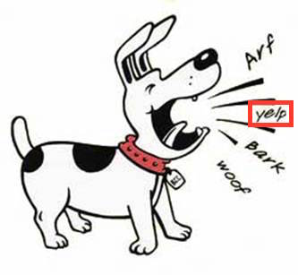

MMIF is an annotation format for audiovisual media and associated text like transcripts and closed captions. It is a JSON-LD format used to transport data between CLAMS services and is inspired by and partially based on LIF, the [LAPPS Interchange Format](https://wiki.lappsgrid.org/interchange/). MMIF is pronounced *mif* or *em-mif*, or, if you like to hum, *mmmmmif*.

MMIF consists of two formal components in addition to this more informal specification:
1. The JSON schema:
  - [https://mmif.clams.ai/0.2.0/schema/mmif.json](schema/mmif.json)
1. The Vocabularies (the type hierarchies):
  - [https://mmif.clams.ai/0.2.0/vocabulary](vocabulary)
  - [http://vocab.lappsgrid.org](http://vocab.lappsgrid.org)

The  JSON schema for MMIF defines the syntactic elements of MMIF which will be explained at length in section 1. These specifications often refer to elements from the CLAMS  and LAPPS Vocabularies which define concepts and their ontological relations, see section 2 for notes on those vocabularies.

Along with the formal specifications and documentation we also provide a reference implementation of MMIF. It is developed in the Python programming language and it will be distributed via github (as source code) as well as via the [Python Package Index](https://pypi.org/) (as a Python library). The package will function as a software development kit (SDK), that helps users (mostly developers) to easily use various features of MMIF in developing their own applications.

We use [semantic versioning](https://semver.org/) with the `major.minor.patch` version scheme. All formal components (this document, the JSON schema and CLAMS vocabulary) share the same version number, while the SDK shares `major` and `minor` numbers with the specification version. See the [versioning notes](versioning.md) for more information.


## 1.  The structure of MMIF files

The [JSON schema](schema/mmif.json) formally define the syntactic structure of a MMIF file. This section is an informal companion to the schema and gives further information.

In essence, a MMIF file represents two things:

1. Media like texts, videos, images and audio recordings. We will call these *documents*.
2. Annotations over those media representing information that was added by CLAMS processing. 

Annotations are always stored separately from the media. They can be directly linked to a slice in the media (a string in a text, a shape in an image, or a time frame in a  video or audio) or they can refer to other annotations, for example to specify relations between text strings. More specifically, a MMIF file contains some metadata, a list of media and a list of annotation views, where each view contains a list of annotation types like Segment, BoundingBox, VideoObject or NamedEntity.

The top-level structure of a MMIF file is as follows:

```json
{
  "metadata": {
    "mmif": "http://miff.clams.ai/0.2.0" },
  "documents": [ ],
  "views": [ ]
}
```

The *metadata* property stores metadata associated with the file. It is not heavily used for now, but we do use it to store the MMIF version used in the document. The *mmif* metadata property is required. You are allowed to add any other metadata properties.


### 1.1. The *documents* property

We assume that when a MMIF document is initialized it is given a list of media and each of these media is either an external file or a text string. These media are all imported into the MMIF file as documents of a certain type and the specifications for each medium/document in stored in the *documents* list. This list is read-only and cannot be extended after initialization. There are no limits on how many documents or how many documents of a certain type are in the list, but typically there will be just a few documents in there.

Here is an example document list with a video and its transcript:

```json
{
  "documents": [
    {
      "@type": "http://mmif.clams.ai/0.2.0/VideoDocument",
      "properties": {
        "id": "m1",
        "mime": "video/mpeg",
        "location": "/var/archive/video-0012.mp4" }
    },
    {
      "@type": "http://mmif.clams.ai/0.2.0/TextDocument",
      "properties": {
        "id": "m2",
        "mime": "text/plain",
        "location": "/var/archive/transcript-0012.txt" }
    }
  ]
}
```

The *@type* key has a special meaning in JSON-LD and it is used to define the type of a datastructure. In MMIF, the value should be a URL that points to a description of the type of document. Above we have a video and a text document and they are described at [http://mmif.clams.ai/0.2.0/VideoDocument](http://mmif.clams.ai/0.2.0/VideoDocument) and [http://mmif.clams.ai/0.2.0/TextDocument](http://mmif.clams.ai/0.2.0/TextDocument) respectively. Currently, four document types are defined: *VideoDocument*, *TextDocument*, *ImageDocument* and *AudioDocument*.

The description also lists the properties that can be used for a type, and above we have the *id*, *mime* and *location* properties, used for the document identifier, its MIME type and the location of the document, which is a URL or a local path to a file. Alternatively, and for text only, the document could be inline, in which case the element is represented as in the *text* property in LIF, which is a JSON [value object](http://www.w3.org/TR/json-ld/#dfn-value-object) containing a *@value* key and optionally a *@language* key:

``` json
{
  "documents": [
    {
      "@type": "http://mmif.clams.ai/0.2.0/VideoDocument",
      "properties": {
        "id": "m1",
        "mime": "video/mpeg",
        "location": "/var/archive/video-0012.mp4" }
    },
    {
      "@type": "http://mmif.clams.ai/0.2.0/TextDocument",
      "properties": {
        "id": "m1",
        "text": {
          "@value": "Sue flew to Bloomington.",
          "@language": "en" } }
    }
  ]
}
```

The value associated with *@value* is a string and the value associated with *@language* follows the rules in [BCP47](http://www.w3.org/TR/json-ld/#bib-bcp47), which for our current purposes boils down to using the two-character ISO 639 code. With inline text there is no MIME type needed.


### 1.2.  The *views* property

This is where all the annotations and associated metadata live. Views contain structured information about documents but are separate from those documents. The value of *views* is a JSON-LD array of view objects where each view specifies what documents the annotation is over, what information it contains and what service created that information. To that end, each view has four properties:  *id*, *metadata* and *annotations*.

```json
{
  "views": [
    {
      "id": "v1",
      "metadata": { },
      "annotations": [ ]
    }
  ]
}
```

Each view has a unique identifier. Annotation elements in the view have identifiers unique to the view and these elements can be uniquely referred to from outside the view by using the view identifier and the annotation element identifier. For example, if the view above has an annotation with identfier "a8" then it can be referred to from outside the view by using "v1:a8".

Here are a few general principles relevant to views:

1. There is no limit to the number of views.
2. Services may create as many new views as they want.
3. Services may not change or add information to existing views, that is, views are read-only, which has many advantages at the cost of some redundancy. Since views are read-only, services may not overwrite or delete information in existing views. This holds for the view’s metadata as well as the annotations.
4. Annotations in views have identifiers that are unique to the view. Views have identifiers that uniquely define them relative to other views. A view identifier may not be a document identifier as well.

We now describe the metadata and the annotations.


#### 1.2.1.  The *view's metadata* property

This property contains information about the annotations in a view. Here is an example for a view over a video with medium identifier "m1" with segments added by the CLAMS bars-and-tones application:

```json
{
  "app": "http://apps.clams.ai/bars-and-tones/1.0.5",
  "timestamp": "2020-05-27T12:23:45",
  "contains": {
    "http://mmif.clams.ai/0.2.0/vocabulary/TimeFrame": {
      "unit": "seconds",
      "document": "m1" } }
}
```

The *contains* dictionary has keys that refer to annotation objects in the CLAMS or LAPPS vocabulary or properties of those annotation objects (they can also refer to user-defined objects or properties) and they indicate the kind of annotations that live in the view. The value of each of those keys is a JSON object which contains metadata specified for the annotation type. The example above has one key that indicates that the view contains *TimeFrame* annotations and it gives two metadata properties for that annotation type:

1. The *document* key gives the identifier of the document that the annotations of that type in this view are over. As we will see later, annotations anchor into documents using keys like *start* and *end* and this property specifies what document that is.
2. The *unit* key is set to "seconds" and this means that for each annotation the unit for the values in *start* and *end* are seconds. 

Note that when a metadata property is set to some value then all annotations of that type should adhere to that value, in this case the document and unit are set to "m1" and "seconds" respectively. It is technically possible to add *documenty* and *unit* properties to individual annotations and overrule the metadata property, but this is not to be done without really good reasons. We get back to this later.

Section 2 has more details on the interaction between the vocabulary and the metadata for the annotation types in the *contains* dictionary.

The *timestamp* key stores when the view was created by the application. This is using the ISO 8601 format where the T separates the date from the time of the day. The timestamp can also be used to order views, which is significant because by default arrays in JSON-LD are not ordered.

The *app* key contains a URL that specifies what application created the annotation data. That URL should contain all metadata information relevant for the application: description, configuration, input requirements and a more complete description of what output is created. The app URL always includes a version number for the app. The metadata should also contain a link to the Git repository for the app (and that repository will actually maintain all the information in the URL).


#### 1.2.2.  The *view's annotations* property

The value of the annotations property on a view is a list of annotation objects. Here is an example of an annotation object:

```json
{
  "@type": "http://mmif.clams.ai/0.2.0/vocabulary/TimeFrame",
  "properties": {
    "id": "f1",
    "start": 0,
    "end": 5,
    "frameType": "bars-and-tones"
  }
}
```

The two required keys are *@type* and *properties*. As mentioned before, the *@type* key in JSON-LD is used to define the type of a datastructure. The *properties* dictionary typically contains the features defined for the annotation category as defined in the vocabularies at [http://mmif.clams.ai/0.2.0/vocabulary](http://mmif.clams.ai/0.2.0/vocabulary) or [http://vocab.lappsgrid.org](http://vocab.lappsgrid.org/). For example, for the *TimeFrame* annotation type the vocabulary includes the feature *frameType* as well as the inherited features *id*, *start* and *end*. Values should be as specified in the vocabulary, values typically are strings, identifiers and integers, or lists of strings, identifiers and integers.

The *id* key should have a value that is unique relative to all annotation elements in the view. Other annotations can refer to this identifier either with just the identifier (for example “s1”) or the identifier with a view identifier prefix (for example “v1:s1”). If there is no prefix the current view is assumed.

The annotations list is shallow, that is, all annotations in a view are in that list and annotations are not embedded inside of other annotations. For example, LAPPS *Constituent* annotations will not contain other *Constituent* annotations. However, in the features dictionary annotations can refer to other annotations using the identifiers of the other annotations.

Here is an other example of a view containing two bounding boxes created by the EAST text recognition app:

```json
{
  "id": "v1",
  "metadata": {
    "app": "http://apps.clams.io/east/1.0.4",
    "timestamp": "2020-05-27T12:23:45",
    "contains": {
      "http://miff.clams.ai/0.2.0/vocabulary/BoundingBox": {
        "document": "image3",
        "unit": "pixels" } },
  },
  "annotations": [
      { "@type": "http://miff.clams.ai/0.2.0/vocabulary/BoundingBox",
        "properties": {
          "id": "bb0",
          "coordinates": [[10,20], [60,20], [10,50], [60,50]] }
      },
      { "@type": "http://miff.clams.ai/0.2.0/vocabulary/BoundingBox",
        "properties": {
          "id": "bb1",
          "coordinates": [[90,40], [110,40], [90,80], [110,80]] }
      }
    ]
  }
}
```

Note how the *coordinates* property is a list of lists where each embedded list is a pair of an x-coordinate and a y-coordinate.


### 1.3.  Views with documents

We have seen that an initial set of media is added to the MMIF *documents* list and that applications then create views from those documents. But some applications are special in that they create text from audiovisual data and the annotations they create are similar to the documents in the *documents* list in that they could be the starting point for a text processing chain. For example, Tesseract can take a bounding box in an image and generate text from it and a Named Entity Recognition (NER) component can take the text and extract entities, just like it would from a transcript or other text document in the *documents* list.

Let's use an example of an image of a barking dog where a region of the image has been recognized by the EAST application as an image box containing text (image taken from [http://clipart-library.com/dog-barking-clipart.html](http://clipart-library.com/dog-barking-clipart.html)): 



The result of this processing is a MMIF document with an image document and a view that contains a *BoundingBox* annotation where the bounding box has the *boxType* property set to "text":

```json
{
  "documents": [
    {
      "@type": "http://mmif.clams.ai/0.2.0/vocabulary/ImageDocument",
      "properties": {
        "id": "m1",
        "mime": "image/jpeg",
        "location": "/var/archive/image-0012.jpg" }
    }
  ],
  "views": [
    {
      "id": "v1",
      "metadata": {
        "app": "http://mmif.clams.ai/apps/east/0.2.1",
        "contains": {
          "http://mmif.clams.ai/0.1.0/BoundingBox": {
            "document": "m1" } },
      },
      "annotations": [
        { 
          "@type": "http://mmif.clams.ai/0.2.0/vocabulary/BoundingBox",
          "properties": {
            "id": "bb1",
            "coordinates": [[10,20], [40,20], [10,30], [40,30]],
            "boxType": "text" }
        }
      ]
    }
  ]
}
```

Tesseract will then add a view to this MMIF document that contains a text document as well as an *Alignment* type that specifies that the text document is aligned with the bounding box from view "v1".

```json
{
  "id": "v2",
  "metadata": {
    "app": "http://mmif.clams.ai/apps/tessearct/0.2.1",
    "contains": {
      "http://mmif.clams.ai/0.1.0/TextDocument": {},
      "http://mmif.clams.ai/0.1.0/Alignment": {} },
  },
  "annotations": [
    { 
      "@type": "http://mmif.clams.ai/0.2.0/vocabulary/TextDocument",
      "properties": {
        "id": "td1",
        "text": {
          "@value": "yelp" } }
    },
    {
      "@type": "http://mmif.clams.ai/0.2.0/vocabulary/Alignment",
      "properties": {
        "source": "v1:bb1",
        "target": "td1" }
    }
  ]
}
```

The text document annotation is the same kind of objects as the text document objects in the toplevel *documents* property, it has the same type and uses the same properties. Notice also that the history of the text document, namely that it was derived from a particular bounding box in a particular image, can be traced via the alignment of the text document with the bounding box.

> An alternative for using an aligment would be to use a *textSource* property on the document or perhaps to reuse the *location* property. That would require less space, but would introduce another ways to align annotations.

Now this text document can be input to language processing. An NER component will not do anything interesting with this text so let's say we have a semantic typing component that has *dog-sound* as one of its categories. That hypothetical semantic typing component would add a new view to the list. That semantic typing component would add a new view to the list:

```json
{
  "id": "v3",
  "metadata": {
    "app": "http://mmif.clams.ai/apps/semantic-typer/0.2.4",
    "contains": {
      "http://mmif.clams.ai/0.2.0/vocabulary/SemanticTag": {
        "document": "V2:td1" } },
  },
  "annotations": [
    { 
      "@type": "http://mmif.clams.ai/0.2.0/vocabulary/SemanticTag",
      "properties": {
        "id": "st1",
        "category": "dog-sound",
        "start": 0,
        "end": 4 }
    }
  ]
}
```

This view encodes that the span from character offset 0 to character offset 4 contains a semantic tag and that the catgeory is "dog-sound". This type can be traced to *TextDocument* "td1" in view "v2" via the *document* metadata property, and from there to the bounding box in the image.

See section 3 with the MMIF examples for a more realistic and larger example.

> We are here abstracting away from how the actual processing would proceed since we are focusing on the representation. In short, the CLAMS platform knows what kind of input an application requires and it would now that an NLP application requires a *TextDocument* to run on and it knows how to find all instance of *TextDOcument* in a MMIF file.


### 1.4.  Multiple text documents in a view

The image with the dog in the previous section just had a bounding box for the part of the image with the word *yelp*, but there were three other image regions that could have been input to OCR as well. With more boxes we just add more text documents and more alignments, here shown for one additional box:

```json
{
  "id": "v2",
  "metadata": {
    "app": "http://mmif.clams.ai/apps/tessearct/0.2.1",
    "contains": {
      "http://mmif.clams.ai/0.1.0/vocabulary/TextDocument": {},
      "http://mmif.clams.ai/0.1.0/vocabulary/Alignment": {} },
  },
  "annotations": [
    { 
      "@type": "http://mmif.clams.ai/0.2.0/vocabulary/TextDocument",
      "properties": {
        "id": "td1",
        "text": {
          "@value": "yelp" } }
    },
    {
      "@type": "http://mmif.clams.ai/0.2.0/vocabulary/Alignment",
      "properties": {
        "source": "v1:bb1",
        "target": "td1" }
    },
    { 
      "@type": "http://mmif.clams.ai/0.2.0/vocabulary/TextDocument",
      "properties": {
        "id": "td2",
        "text": {
          "@value": "woof" } }
    },
    {
      "@type": "http://mmif.clams.ai/0.2.0/vocabulary/Alignment",
      "properties": {
        "source": "v1:bb2",
        "target": "td2" }
    }
  ]
}
```

This of course assumes that view "v1" has a bounding box identified by "v1:bb2". 

Now if you run the semantic tagger you would get to tags with the category set to "dog-sound":

```json
{
  "id": "v3",
  "metadata": {
    "app": "http://mmif.clams.ai/apps/semantic-typer/0.2.4",
    "contains": {
      "http://mmif.clams.ai/0.2.0/vocabulary/SemanticTag": {} },
  },
  "annotations": [
    { 
      "@type": "http://mmif.clams.ai/0.2.0/vocabulary/SemanticTag",
      "properties": {
        "id": "st1",
        "category": "dog-sound",
        "document": "V2:td1",
        "start": 0,
        "end": 4 }
    },
    { 
      "@type": "http://mmif.clams.ai/0.2.0/vocabulary/SemanticTag",
      "properties": {
        "id": "st2",
        "category": "dog-sound",
        "document": "V2:td2",
        "start": 0,
        "end": 4 }
    }
  ]
}
```

Notice how the document to which the *SemanticTag* annotations point is not expressed by the metadata *document* property but by individual *document* properties on each semantic tag. This is unavoidable when we have multiple text documents that can be input to language processing.

> The above glances over the problem that we need some way for Tesseract to know what bounding boxes to take. We can do that by either introducing some kind of type or use the *app* property in the metadata or maybe by introducing a subtype for BoundingBox like TextBox. In general, we may need to solve what we never really solved for LAPPS which is what view should be used as input for an application.


## 2. MIFF and the Vocabularies

The structure of MMIF files is defined in the [schema](schema/mmif.json)  and described in this document. But the semantics of what is expressed in the views are determined by the [CLAMS Vocabulary](vocabulary). Each annotation in a view has two fields: *@type* and *properties*. The value of the first one is typically an annotation type from the vocabulary. Here is a *BoundingBox* annotation as an example:

```json
{
  "@type": "http://mmif.clams.ai/0.1.0/vocabulary/BoundingBox",
  "properties": {
    "id": "bb1",
    "coordinates": [[0,0], [10,0], [0,10], [10,10]]
  }
}
```

The value of *@type* refers to the URL [http://mmif.clams.ai/0.2.0/vocabulary/BoundingBox](http://mmif.clams.ai/0.2.0/vocabulary/BoundingBox) which is a page in the published vocabulary. That page will spell out the definition of *BoundingBox* as well as list all properties defined for it, whether inherited or not. On the page we can see that *id* is a required property inherited from *Annotation* and that *coordinates* is a required property of *BoundingBox*. Both are expressed in the properties dictionary above. The page also says that there is an optional property *timePoint*, but it is not used above.

The vocabulary also defines metadata properties. For example, the optional property *unit* can be used for a *BoundingBox* to specify what unit is used for the coordinates in instances of *BoundingBox*. This property is not expressed in the annotation but in the metadata of the view with the annotation type in the *contains* section:

```json
{
  "metadata": {
    "app": "http://apps.clams.ai/some_bounding_box_app/1.0.3",
    "timestamp": "2020-05-27T12:23:45",
    "contains": {
        "http://mmif.clams.ai/0.1.0/vocabulary/BoundingBox": {
          "document": "m12",
          "unit": "pixels" } },
  }
}
```

Annotations in a MMIF file often refer to the LAPPS Vocabulary at [http://vocab.lappsgrid.org](http://vocab.lappsgrid.org). In that case, the annotation type in *@type* will refer to a URL just as with CLAMS annotation types, the only difference is that the URL will be in the LAPPS Vocabulary. Properties and metadata properties of LAPPS annotation types are defined and used the same way as described above for CLAMS types.

Using a LAPPS type is actually an instance of the more general notion that the value of *@type* can be any URL (actually, any IRI). You can use any annotation category defined elsewhere, for example, you can use categories defined by the creator of an application or categories from other vocabularies. Here is an example with a type from [https://schema.org](https://schema.org):

```json
{
  "@type": "https://schema.org/Clip",
  "properties": {
    "id": "clip-29",
    "actor": "Geena Davis"
  }
}
```

This assumes that [https://schema.org/Clip](https://schema.org/Clip) defines all the features used in the *properties* dictionary. One little disconnect here is that in MMIF we insist on each annotation having an identifier in the *id* property and as it happens [https://schema.org](https://schema.org) does not define an *id* attribute, although it does define *identifier*. 

The CLAMS Platform does require that a URL like [https://schema.org/Clip](https://schema.org/Clip) actually exists, but if it doesn't users of an application that creates the *Clip* type will not necessarily know exactly what the application does.


## 3. MIFF Examples

To finish off this document we provide some examples of complete MMIF documents. We have the following examples:


| example                                                   | description                                                  |
| --------------------------------------------------------- | ------------------------------------------------------------ |
| [bars-tones-slates](samples/bars-tones-slates.md)         | A couple of time frames and some minimal text processing on a transcript. |
| [east-tesseract-typing](samples/east-tesseract-typing.md) | EAST text box recognition followed by Tesseract OCR and semantic typing. |
| [segmenter-kaldi-ner](samples/segmenter-kaldi-ner.md)     | Audio segmentation followed by Kaldi speech recognition and NER. |


Each example has some comments and a link to a raw JSON file.

As we move along with integrating new applications, other examples will be added with other kinds of annotation types.


