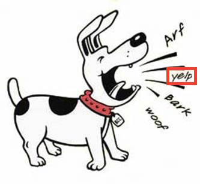

MMIF is an annotation format for audiovisual media and associated text like transcripts and closed captions. It is a JSON-LD format used to transport data between CLAMS apps and is inspired by and partially based on LIF, the [LAPPS Interchange Format](https://wiki.lappsgrid.org/interchange/). MMIF is pronounced *mif* or *em-mif*, or, if you like to hum, *mmmmmif*.

MMIF consists of two formal components in addition to this more informal specification:
1. The JSON schema:
  - [https://mmif.clams.ai/$VERSION/schema/mmif.json](schema/mmif.json)
1. The Vocabulary (the type hierarchy):
  - [https://clams.ai/vocabulary/](https://clams.ai/vocabulary/)

The JSON schema for MMIF defines the syntactic elements of MMIF which will be explained at length in ["structure" section](#the-structure-of-mmif-files). These specifications often refer to elements from the CLAMS Vocabulary which defines concepts and their ontological relations, see ["vocabulary" section](#mmif-and-the-vocabulary) for notes on the vocabulary.

Along with the formal specifications and documentation we also provide a reference implementation of MMIF. It is developed in the Python programming language, and it will be distributed via GitHub (as source code) as well as via the [Python Package Index](https://pypi.org/) (as a Python library). The package will function as a software development kit (SDK), that helps users (mostly developers) to easily use various features of MMIF in developing their own applications.

We use [semantic versioning](https://semver.org/) with the `major.minor.patch` version scheme. This document and the JSON schema share the same version number. The CLAMS Vocabulary is now maintained and versioned independently as the [`clams-vocabulary`](https://pypi.org/project/clams-vocabulary/) Python package. The `mmif-python` Python SDK shares `major` and `minor` numbers with the specification version. See the [versioning notes](../versioning) for more information on compatibility between different versions and how it plays out when chaining CLAMS apps in a pipeline.

## Table of Contents
{:.no_toc}

1. toc placeholder
{:toc}

## The format of MMIF files
As mentioned, MMIF is JSON in essence. When serialized to a physical file, the file must use **Unicode** charset encoded in **UTF-8**. 

## The structure of MMIF files

The [JSON schema](schema/mmif.json) formally define the syntactic structure of a MMIF file. This section is an informal companion to the schema and gives further information.

In essence, a MMIF file represents two things:

1. Media like texts, videos, images and audio recordings. We will call these *documents*.
2. Annotations over those media representing information that was added by CLAMS processing. 

Annotations are always stored separately from the media. They can be directly linked to a slice in the media (a string in a text, a shape in an image, or a time frame in a  video or audio) or they can refer to other annotations, for example to specify relations between text strings. More specifically, a MMIF file contains some metadata, a list of media and a list of annotation views, where each view contains a list of annotation types like Segment, BoundingBox, VideoObject or NamedEntity.

The top-level structure of a MMIF file is as follows:

```json
{
  "metadata": {
    "mmif": "http://mmif.clams.ai/$VERSION" },
  "documents": [ ],
  "views": [ ]
}
```

The `metadata` property stores metadata associated with the file. It is not heavily used for now, but we do use it to store the MMIF version used in the document. The `mmif` metadata property is required. You are allowed to add any other metadata properties.


### The *documents* property

We assume that when a MMIF document is initialized it is given a list of media and each of these media is either an external file or a text string. These media are all imported into the MMIF file as documents of a certain type and the specifications for each medium/document is stored in the `documents` list. This list is read-only and cannot be extended after initialization. There are no limits on how many documents and how many documents of what types are in the list, but typically there will be just a few documents in there.

Here is an example document list with a video and its transcript:

```json
{
  "documents": [
    {
      "@type": "http://clams.ai/vocabulary/type/VideoDocument/v?",
      "properties": {
        "id": "m1",
        "mime": "video/mpeg",
        "location": "file:///var/archive/video-0012.mp4" }
    },
    {
      "@type": "http://clams.ai/vocabulary/type/TextDocument/v?",
      "properties": {
        "id": "m2",
        "mime": "text/plain",
        "location": "file:///var/archive/transcript-0012.txt" }
    }
  ]
}
```

The `@type` key has a special meaning in JSON-LD and it is used to define the type of data structure. In MMIF, the value should be a URI that identifies a type defined in the [CLAMS Vocabulary](https://clams.ai/vocabulary/). Above we have a video and a text document, using the *VideoDocument* and *TextDocument* types respectively. Currently, four document types are defined: *VideoDocument*, *TextDocument*, *ImageDocument* and *AudioDocument*. Visit the [CLAMS Vocabulary](https://clams.ai/vocabulary/) for full details on each type and its properties.

The vocabulary defines what properties are available for each type. Above we have the `id`, `mime` and `location` properties, used for the document identifier, the document's MIME type and the location of the document, which is a URL. Should the document be a local file then the `file://` scheme must be used. Alternatively, and for text only, the document could be inline, in which case the element is represented as in the `text` property in LIF, using a JSON [value object](http://www.w3.org/TR/json-ld/#dfn-value-object) containing a `@value` key and optionally a `@language` key:


```json
{
  "documents": [
    {
      "@type": "http://clams.ai/vocabulary/type/VideoDocument/v?",
      "properties": {
        "id": "m1",
        "mime": "video/mpeg",
        "location": "file:///var/archive/video-0012.mp4" }
    },
    {
      "@type": "http://clams.ai/vocabulary/type/TextDocument/v?",
      "properties": {
        "id": "m1",
        "text": {
          "@value": "Sue flew to Bloomington.",
          "@language": "en" } }
    }
  ]
}
```

The value associated with `@value` is a string and the value associated with `@language` follows the rules in [BCP47](http://www.w3.org/TR/json-ld/#bib-bcp47), which for our current purposes boils down to using the two-character ISO 639 code. With inline text no MIME type is needed.


### The *views* property

This is where all the annotations and associated metadata live. Views contain structured information about documents but are separate from those documents. The value of `views` is a JSON-LD array of view objects where each view specifies what documents the annotation is over, what information it contains and what app created that information. To that end, each view has three top-level keys: `id`, `metadata` and `annotations`.

```json
{
  "views": [
    {
      "id": "v1",
      "metadata": { },
      "annotations": [ ]
    }
  ]
}
```
The view's `id` (here `"v1"`) is a string that uniquely identifies the view within the MMIF. The colon character (`:`) is reserved as the delimiter used in annotation identifiers (see below) so it must not appear inside any individual `id` value. The annotation ID convention is detailed further in the [annotations section](#the-views-annotations-property).


Here are a few general principles relevant to views:

1. There is no limit to the number of views.
1. Apps may create as many new views as they want.
1. Apps may not change or add information to existing views, that is, views are generally considered read-only, which has many advantages at the cost of some redundancy. Since views are read-only, apps may not overwrite or delete information in existing views. This holds for the view’s metadata as well as the annotations.

We now describe the metadata and the annotations.

#### The *view's metadata* property

This property contains information about the annotations in a view. Here is an example for a view over a video with medium identifier "m1" with segments added by the CLAMS bars-and-tones application:

```json
{
  "app": "http://apps.clams.ai/bars-and-tones/1.0.5",
  "timestamp": "2020-05-27T12:23:45",
  "contains": {
    "http://clams.ai/vocabulary/type/TimeFrame/v?": {
      "timeUnit": "seconds",
      "document": "m1" 
    }
  },
  "parameters": {"threshold": "0.5", "not-defined-parameter":  "some-value"},
  "appConfiguration": {"threshold": 0.5},
  "appProfiling": {
    "runningTime": "0:00:05.466913",
    "hardware": {
      "cpu": "x86_64, 8 cores",
      "cuda": ["NVIDIA GeForce RTX 3060, 12.00 GiB total, 8.63 GiB available, 3.37 GiB peak used"]
    }
  }
}
```

The `timestamp` key stores when the view was created by the application. This is using the ISO 8601 format where the T separates the date from the time of the day. The timestamp can also be used to order views, which is significant because by default arrays in JSON-LD are not ordered.

The `app` key contains an identifier that specifies what application created the view. The identifier must be a URL form, and HTTP webpage pointed by the URL should contain all app metadata information relevant for the application: description, configuration, input/output specifications and a more complete description of what output is created. The app identifier always includes a version number for the app. The metadata should also contain a link to the public code repository for the app (and that repository will actually maintain all the information in the URL).

The `parameters` key contains a dictionary of runtime parameters and their *string* values, if any.  The primary purpose of this dictionary is to record the parameters "as-is" for reproducibility and accountability.  Note that CLAMS apps are developed to run as HTTP servers, expecting parameters to be passed as URL query strings.  Hence, the values in the `parameters` dictionary are always strings or simple lists of strings.  How exactly each runtime parameter ends up in this dictionary is up to the app implementation, but the recommended behavior (and the convention assumed in the examples in this document) is to record every parameter received at runtime verbatim, including keys that the app does not recognize as part of its declared parameter specification.  In the example above, `not-defined-parameter` illustrates such a case: it is not a parameter the app knows about, but it was passed in the request and is recorded here as the reference behavior.  Under this convention, unrecognized keys are dropped during refinement and will not appear in `appConfiguration` (see below).


The `appConfiguration` is a dictionary of parameters and their values, after some automatic refinement of the runtime 
parameters, that were actually used by the app. For the time being, automatic refinement includes:

1. Converting data types according to the parameter specification.
2. Adding default values for parameters that the user didn't specify.
3. Removing undefined parameters.

But refinedment process can be more complex in the future. 

The optional `appProfiling` is a dictionary of runtime measurements collected by the app while producing this view. The only sub-field formally defined by this specification is `runningTime`, a string holding the wall-clock duration of the app's processing call; the spec does not mandate an encoding. All other sub-fields of `appProfiling`, such as the `hardware` block in the example above, are at the app's discretion and may evolve independently of the spec; consumers must tolerate unknown sub-fields and treat them as advisory. As with `parameters` and `appConfiguration`, the contents are recorded for reproducibility and accountability and are not part of the annotation payload.

**Reference implementation:** the reference `clams-python` SDK emits `runningTime` in Python's native `str(datetime.timedelta)` form `[D day[s], ]H:MM:SS[.ffffff]` (e.g. `"0:00:05.466913"`, `"1 day, 2:03:04"`). The rest of the reference implementation stack (e.g. `mmif-python`'s workflow helper) expects this form when consuming `runningTime`.
{: .box-note}

Other encodings that may appear from non-reference producers:

| Convention | Format | Example |
|---|---|---|
| ISO 8601 *time-of-day* | `HH:MM:SS` with optional decimal seconds (≤ 24 hours) | `"01:23:45.678"` |
| ISO 8601 *duration* (period) | `P[n]DT[n]H[n]M[n]S` with optional decimal seconds | `"PT5.466913S"`, `"P1DT2H3M4S"` |
| Python `str(timedelta)` | `[D day[s], ]H:MM:SS[.ffffff]` | `"0:00:05.466913"`, `"1 day, 2:03:04"` |

ISO 8601 leaves fractional-second precision implementation-defined; the six-digit microsecond shown in the Python row is specific to Python.
{: .box-note}

The `contains` dictionary has keys that refer to annotation types in the CLAMS Vocabulary or user-defined types. Namely, they indicate the kind of annotations that live in the view. The value of each of those keys is a JSON object which contains metadata specified for the annotation type. The example above has one key that indicates that the view contains *TimeFrame* annotations, and it gives two metadata values for that annotation type:

1. The `document` key gives the identifier of the document that the annotations of that type in this view are over. As we will see later, annotations anchor into documents using keys like `start` and `end` and this property specifies what document that is.
2. The `timeUnit` key is set to "seconds" and this means that for each annotation the unit for the values in `start` and `end` are seconds. 

The `contains` dictionary in a view's metadata serves as a place for view-level default values for properties shared among annotations of a type. In the example above, `document` and `timeUnit` are set to *"m1"* and *"seconds"* respectively, meaning all *TimeFrame* annotations in this view share those values. This is especially useful for the `document` property, as in a single view, an app is likely to process only a limited number of source documents. It is possible for individual annotations to set the same property in their own `properties` dictionary, in which case the annotation-level value takes precedence over the view-level default.
{: .box-note}

Different anchoring modalities use different units — for example, time-based types require a `timeUnit` property, while spatial and text-based types have fixed units. See the [CLAMS Vocabulary](https://clams.ai/vocabulary/) for details on each type's unit conventions.
{: .box-note}

Next section has more details on the interaction between the vocabulary and the metadata for the annotation types in the `contains` dictionary.

When an app fails to process the input for any reason and produces an error, it can record the error in the `error` field, instead of in `contains`. When this happens, the annotation list of the view must remain empty. Here is an example of a view with an error.

```json
{ 
  "id": "v1", 
  "metadata": {
    "app": "http://apps.clams.ai/bars-and-tones/1.0.5",
    "timestamp": "2020-05-27T12:23:45",
    "error": {
      "message": "FileNotFoundError: /data/input.mp4 from Document d1 is not found.",
      "stackTrace": "Optionally, some-stack-traceback-information"
    },
    "parameters": {}
  },
  "annotations": []
}
```

Finally, an app may produce one or more warnings and still successfully process input and create annotations. In that case one extra view is added that has no annotations and that instead of the `contains` field has a `warnings` field which presents the warning messages as a list of strings.

```json
{
  "id": "v2",
  "metadata": {
    "app": "http://apps.clams.ai/bars-and-tones/1.0.5",
    "timestamp": "2020-05-27T12:23:45",
    "warnings": ["Missing parameter frameRate, using default value."],
    "parameters": {}
  },
  "annotations": []
}
```


#### The *view's annotations* property

The value of the `annotations` property on a view is a list of annotation objects. Here is an example of an annotation object:

```json
{
  "@type": "http://clams.ai/vocabulary/type/TimeFrame/v?",
  "properties": {
    "id": "f1",
    "start": 0,
    "end": 5,
    "label": "bars-and-tones"
  }
}
```

The two required keys are `@type` and `properties`. As mentioned before, the `@type` key in JSON-LD is used to define the type of data structure. The `properties` dictionary contains the properties defined for the annotation type in the [CLAMS Vocabulary](https://clams.ai/vocabulary/). Value types for properties are specified in the vocabulary and typically are strings, identifiers (referring to other annotations) and integers, or lists thereof, but can be more complex.

We will discuss more details on annotation type vocabularies in the ["vocabulary" section](#mmif-and-the-vocabulary). 
{: .box-note}

Regardless of the type, all annotations must have the `id` property. The `id` should have a string value that is unique relative to all annotation elements in the MMIF, and these annotations can be uniquely referred to by using these identifier. By convention, we use annotation identifiers prefixed with their parent_ view identifiers, separated by a colon (`:`). For example, if the time frame annotation above is in the `"v1"` view's annotations list, then it should be assigned with identifier `"v1:f1"`, and later can be referred to by other annotations using `"v1:f1"`. This is the reference implementation in the `mmif-python` Python SDK, and its purpose is to eliminate possible ambiguity. That said, views in the top-level `views` field and documents in the top-level `documents` field do not have the _parent_ view to prefix, hence their identifier format is much simpler.

Note that the colon character (`:`) is reserved, by convention, as the delimiter in prefixed annotation identifiers, hence can't be used as a part of ID strings
{: .box-warning}

The annotations list is shallow, that is, all annotations in a view are in that list and annotations are not embedded inside other annotations. However, the values of individual property can have arbitrarily complex data structures, as long as the structure and the type is well-documented in the underlying type definitions. 
Here is another example of a view containing two bounding boxes created by a text localization app:

```json
{
  "id": "v1",
  "metadata": {
    "app": "http://apps.clams.io/east/1.0.4",
    "timestamp": "2020-05-27T12:23:45",
    "contains": {
      "http://clams.ai/vocabulary/type/BoundingBox/v?": {
        "document": "image3"
      } 
    }
  },
  "annotations": [
    { "@type": "http://clams.ai/vocabulary/type/BoundingBox/v?",
      "properties": {
        "id": "v1:bb0",
        "coordinates": [[10,20], [60,20], [10,50], [60,50]] }
    },
    { "@type": "http://clams.ai/vocabulary/type/BoundingBox/v?",
      "properties": {
        "id": "v1:bb1",
        "coordinates": [[90,40], [110,40], [90,80], [110,80]] }
    }
  ]
}
```

Note how the `coordinates` property is a list of lists where each embedded list is a pair of an x-coordinate and a y-coordinate. 

### Views with documents

We have seen that an initial set of media is added to the MMIF `documents` list and that applications then create views from those documents. But some applications are special in that they create text from audiovisual data and the annotations they create are similar to the documents in the `documents` list in that they could be the starting point for a text processing chain. For example, a text recognition app (OCR) can take a bounding box in an image and generate text from it and a Named Entity Recognition (NER) component can take the text and extract entities, just like it would from a transcript or other text document in the `documents` list.

Let's use an example of an image of a barking dog where a region of the image has been recognized by the EAST application as an image box containing text (image taken from [http://clipart-library.com/dog-barking-clipart.html](http://clipart-library.com/dog-barking-clipart.html)): 



The result of this processing is a MMIF document with an image document and a view that contains a *BoundingBox* annotation where the bounding box has the `label` property set to "text":

```json
{
  "documents": [
    {
      "@type": "http://clams.ai/vocabulary/type/ImageDocument/v?",
      "properties": {
        "id": "m1",
        "mime": "image/jpeg",
        "location": "file:///var/archive/image-0012.jpg" }
    }
  ],
  "views": [
    {
      "id": "v1",
      "metadata": {
        "app": "http://mmif.clams.ai/apps/east/0.2.2",
        "contains": {
          "http://clams.ai/vocabulary/type/BoundingBox/v?": {
            "document": "m1" } }
      },
      "annotations": [
        { 
          "@type": "http://clams.ai/vocabulary/type/BoundingBox/v?",
          "properties": {
            "id": "v1:bb1",
            "coordinates": [[10,20], [40,20], [10,30], [40,30]],
            "label": "text" }
        }
      ]
    }
  ]
}
```

The OCR app will then add a view to this MMIF document that contains a text document as well as an *Alignment* type that specifies that the text document is aligned with the bounding box from view "v1".

```json
{
  "id": "v2",
  "metadata": {
    "app": "http://mmif.clams.ai/apps/tesseract/0.2.2",
    "contains": {
      "http://clams.ai/vocabulary/type/TextDocument/v?" : {},
      "http://clams.ai/vocabulary/type/Alignment/v?": {} }
  },
  "annotations": [
    { 
      "@type": "http://clams.ai/vocabulary/type/TextDocument/v?",
      "properties": {
        "id": "v2:td1",
        "text": {
          "@value": "yelp" } }
    },
    {
      "@type": "http://clams.ai/vocabulary/type/Alignment/v?",
      "properties": {
        "source": "v1:bb1",
        "target": "v2:td1" }
    }
  ]
}
```

The text document annotation is the same kind of object as the text document objects in the toplevel `documents` property, it has the same type and uses the same properties. Notice also that the history of the text document, namely that it was derived from a particular bounding box in a particular image, can be traced via the alignment of the text document with the bounding box. Also notice that when a document in a view is referred to, the reference takes the "long" form ID. 

Now this text document can be input to language processing. A named entity recognition (NER) component will not do anything interesting with this text so let's say we have a semantic typing component that has *"dog-sound"* as one of its categories. That hypothetical semantic typing component would add a new view to the list. That semantic typing component would add a new view to the list:

```json
{
  "id": "v3",
  "metadata": {
    "app": "http://mmif.clams.ai/apps/semantic-typer/0.2.4",
    "contains": {
      "http://vocab.lappsgrid.org/SemanticTag": {
        "document": "v2:td1" } }
  },
  "annotations": [
    { 
      "@type": "http://vocab.lappsgrid.org/SemanticTag",
      "properties": {
        "id": "v3:st1",
        "category": "dog-sound",
        "start": 0,
        "end": 4 }
    }
  ]
}
```

This view encodes that the span from character offset 0 to character offset 4 contains a semantic tag and that the category is "dog-sound". This type can be traced to *TextDocument* "td1" in view "v2" via the `document` metadata property, and from there to the bounding box in the image.

See ["examples" section](#mmif-examples) with the MMIF examples for a more realistic and larger example.

We are here abstracting away from how the actual processing would proceed since we are focusing on the representation. In short, the CLAMS platform knows what kind of input an application requires and it would now that an NLP application requires a *TextDocument* to run on and it knows how to find all instance of *TextDocument* in a MMIF file.
{: .box-note}


### Multiple text documents in a view

The image with the dog in the previous section just had a bounding box for the part of the image with the word *yelp*, but there were three other image regions that could have been input to OCR as well. With more boxes we just add more text documents and more alignments, here shown for one additional box:

```json
{
  "id": "v2",
  "metadata": {
    "app": "http://mmif.clams.ai/apps/tesseract/$VERSION",
    "contains": {
      "http://clams.ai/vocabulary/type/TextDocument/v?": {},
      "http://clams.ai/vocabulary/type/Alignment/v?": {} }
  },
  "annotations": [
    { 
      "@type": "http://clams.ai/vocabulary/type/TextDocument/v?",
      "properties": {
        "id": "v2:td1",
        "text": {
          "@value": "yelp" } }
    },
    {
      "@type": "http://clams.ai/vocabulary/type/Alignment/v?",
      "properties": {
        "source": "v1:bb1",
        "target": "v2:td1" }
    },
    { 
      "@type": "http://clams.ai/vocabulary/type/TextDocument/v?",
      "properties": {
        "id": "v2:td2",
        "text": {
          "@value": "woof" } }
    },
    {
      "@type": "http://clams.ai/vocabulary/type/Alignment/v?",
      "properties": {
        "source": "v1:bb2",
        "target": "v2:td2" }
    }
  ]
}
```

This of course assumes that view "v1" has a bounding box identified by "v1:bb2". 

Now if you run the semantic tagger you would get tags with the category set to "dog-sound":

```json
{
  "id": "v3",
  "metadata": {
    "app": "http://mmif.clams.ai/apps/semantic-typer/0.2.4",
    "contains": {
      "http://vocab.lappsgrid.org/SemanticTag": {} }
  },
  "annotations": [
    { 
      "@type": "http://vocab.lappsgrid.org/SemanticTag",
      "properties": {
        "id": "v3:st1",
        "category": "dog-sound",
        "document": "V2:td1",
        "start": 0,
        "end": 4 }
    },
    { 
      "@type": "http://vocab.lappsgrid.org/SemanticTag",
      "properties": {
        "id": "v3:st2",
        "category": "dog-sound",
        "document": "V2:td2",
        "start": 0,
        "end": 4 }
    }
  ]
}
```

Notice how the document to which the *SemanticTag* annotations point is not expressed by the metadata `document` property but by individual `document` properties on each semantic tag. This is unavoidable when we have multiple text documents that can be input to language processing.

The above glances over the problem that we need some way for the OCR app to know what bounding boxes to take. We can do that by either introducing some kind of type or use the `app` property in the metadata or maybe by introducing a subtype for BoundingBox like TextBox. In general, the question of which view should be used as input for an application remains an open design problem (see [clams-python#262](https://github.com/clamsproject/clams-python/issues/262)).
{: .box-note}


## MMIF and the Vocabulary

The structure of MMIF files is defined in the [schema](schema/mmif.json) and described in this document. But the semantics of what is expressed in the views are determined by the [CLAMS Vocabulary](https://clams.ai/vocabulary/), which is maintained and versioned independently of this specification. Each annotation in a view has two fields: `@type` and `properties`. The value of `@type` is typically an annotation type URI from the vocabulary. Here is a *BoundingBox* annotation as an example:

```json
{
  "@type": "http://clams.ai/vocabulary/type/BoundingBox/v?",
  "properties": {
    "id": "v0:bb1",
    "coordinates": [[0,0], [10,0], [0,10], [10,10]]
  }
}
```

The `@type` value is a URI that identifies an annotation type defined in the vocabulary. Each type has its own version number (e.g. `/v1`, `/v5`), independent of the MMIF spec version. The vocabulary documents what properties each type supports, which are required or optional, and which are inherited from parent types. The independent versioning of annotation types enables type checking in CLAMS pipelines. See [versioning notes](../versioning) for more details.

Annotation types in the vocabulary are hierarchically structured with `is-a` inheritance relations, where all properties from a parent type are *inherited* by its children. The top-level annotation type is *Annotation*, which can be used for attaching information to a source document via its `document` property. If an annotation is specifically about a part of the document (for example, a certain sentence in the text or a certain area of the image), one should use a more specific subtype of *Annotation* that can anchor to the relevant region. See the [CLAMS Vocabulary](https://clams.ai/vocabulary/) for the full type hierarchy and property definitions.

Some properties can be expressed at the view level rather than on individual annotations. In MMIF serialization, these are set in the `contains` dictionary of the view's metadata, where they serve as defaults for all annotations of that type in the view. For example, `timeUnit` specifies the unit for time-based annotations and `document` identifies the source document. If the same property appears both in `contains` and in an individual annotation's `properties`, the annotation-level value takes precedence. Unless there is a good reason to specify properties per annotation, using the view-level `contains` is recommended.
{: .box-warning}

```json
{
  "metadata": {
    "app": "http://apps.clams.ai/some_time_segmentation_app/1.0.3",
    "timestamp": "2020-05-27T12:23:45",
    "contains": {
        "http://clams.ai/vocabulary/type/TimeFrame/v?": {
          "document": "m12",
          "timeUnit": "milliseconds" } }
  }
}
```

The value of `@type` can be any URI, not just a CLAMS Vocabulary type. You can use any annotation category defined elsewhere, for example, categories defined by the creator of an application or types from other vocabularies. Here is an example with a type from [https://schema.org](https://schema.org):

```json
{
  "@type": "https://schema.org/Clip",
  "properties": {
    "id": "clip-29",
    "actor": "Geena Davis"
  }
}
```

This assumes that [https://schema.org/Clip](https://schema.org/Clip) defines all the features used in the `properties` dictionary. One little disconnect here is that in MMIF we insist on each annotation having an identifier in the `id` property and as it happens [https://schema.org](https://schema.org) does not define an `id` attribute, although it does define `identifier`. 

The CLAMS Platform does not require that a URL like [https://schema.org/Clip](https://schema.org/Clip) actually exists, but if it doesn't users of an application that creates the *Clip* type will not know exactly what the application creates.


## MMIF Examples

To finish off this document we provide some examples of complete MMIF documents:


| example                                                | description                                                                         |
|--------------------------------------------------------|-------------------------------------------------------------------------------------|
| [bars-tones-slates](samples/bars-tones-slates)         | A couple of time frames and some minimal text processing on a transcript.           |
| [east-tesseract-typing](samples/east-tesseract-typing) | EAST text box recognition followed by Tesseract OCR and semantic typing.            |
| [segmenter-kaldi-ner](samples/segmenter-kaldi-ner)     | Audio segmentation followed by Kaldi speech recognition and NER.                    |
| [everything](samples/everything)                       | A big MMIF example with various multimodal AI apps for video/audio as well as text. |

Each example has some comments and a link to a raw JSON file. Note that these examples may be outdated as they are no longer updated by the spec build process.

Validated, up-to-date MMIF examples are maintained in the [`mmif-python`](https://github.com/clamsproject/mmif-python) repository as test fixtures.

