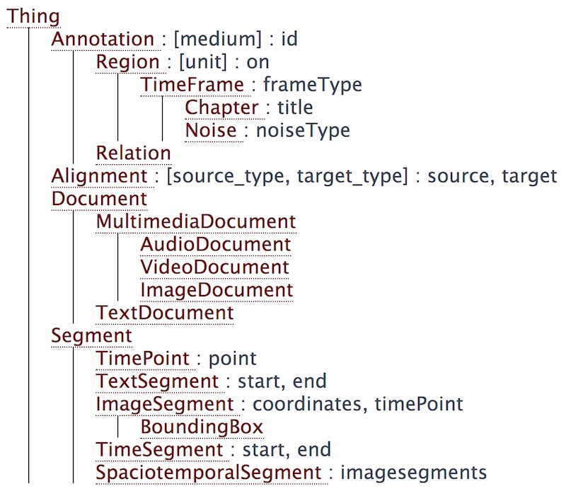

# Media and Views

**Discussion notes on media and views from August 2020**

Kept here for historical reasons.

Having a good approach to dealing with primary data and text derived from primary data is now becoming a bottle neck. Some key points from the current proposal/specifications:

- Use media to store the primary data
  - What we expect as primary data is videos, images, audio streams and transcripts.
- Applications process the primary data and generate views
  - Views contain any of the annotation types in the vocabulary
- Some applications though generate text from audio, video and images
  - For these we generate new media
  - These media are not really primary data since they were derived, but they can be seen as primary because we do not ever change them and separate them from any annotations
  - They do take on some characteriztics of views since we now need metadata spelling out how these media came into existence.
  - But we do not want one medium for every piece of text found in a video
    - So we group media and use submedia
  - This is all untested though
- NLP apps always start from a text medium.
  - This made more sense to us then some unprincipled way of digging into views and finding what we need
  - Contrary to LAPPS, either the NLP app or the platform has to know how to find these submedia and iterate over them

We have (or could have) several kinds of tools:

- media → views:
  - Most are like this
- views → views
  - For example, take all tokens from a view and run a splitter over them without looking at the text
- media → media 
  - We could have tools that directly create media from existing media, for example by creating an image from some frame in a video
- views → media
  - We once discussed having tools that go through a view and create new text media from it

This is all somewhat messy:

- Primary data are not primary.
- Tools can run on anything and we do not yet have anything to model input and output requirements. 
- We need to introduce sets in the primary data, duplicating a system we already have for views.
- There appears to be a general unease with this

We are considering to not add media and let NLP apps work from views. This is something we considered before but found somewhat tricky because we then need to deal with NLP apps running on either primary data or on stuff buried in a view.

I now think there is a somewhat principled way of doing this, and it takes in part of what Keigh has suggested (see immediately below).

We are also considering Keigh's suggestion for a redesigned vocabulary (https://github.com/clamsproject/mmif/tree/59-alignment), and see if it has anything to offer on this issue.



<p/>
This suggestion introduced two main changes:

- Add Document and subtypes for video et al to the hierarchy
  - We had this in LAPPS, but have not added it to CLAMS because we did not know whether we needed it and because some people (mostly me) thought the vocabulary was for annotation types only.
- Make a principled split between annotations that anchor to primary data (via start/end or other anchoring mechanisms) and annotations that target those anchors. There would be anchor types for all kinds of data (text, image, video, time, etcetera). This also included adding a segmentations list to each medium (not shown in the image above). This list has all annotations that anchor to the medium. Other annotations would live in views.
  - One problem was a potential proliferation of names and had annotations stored at two separate spots
  - It is also not clear to me what problem this solves that cannot be solved without this split
  - We do however need a more sophisticated and tested idea of how to do anchoring
  - As an alternative we maybe can do something as simple as GATE which just leaves anchor points

Note that while this proposal is in the 59-alignment branch it does not change the alignment type itself.

My suggestion now is to 

1. adopt the idea of adding document types (although *ImageDocument* et al should probably not be subtypes of *MultimediaDocumet*),
2. postpone a decision on the two annotation types until we fully understand how anchors work.


## 1.  What if we do not add media?

So the list of media is read only and the media are really primary in that we consider them as data handed to us before any of *our* processing. The data themselves may of course have been created by some previous processing, manual or automatic, but we don't care and MMIF will not attempt to keep track of where those data came from, that would be the responsibility of some external application or database.

> Do note however that since MMIF allows arbitrary properties we can sneak in information on the genesis of primary data (why this is will become clear soon).

Applications do not take media as input but instead take a particular kind of thingie as input and that thingie could be a medium. And applications can only create views, nothing else.

Here is how this can work. 

### 1.1.  Representing media

The current specifications has media represented as follows:

```json
{
  "id": "m1",
  "type": "video",
  "mime": "video/mp4",
  "location": "/var/archive/video-0012.mp4"
}
```

My suggestion is to use something slightly different and represent them as two documents, here shown for an image and a text:

```json
{
  "@type": "http://mmif.clams.ai/0.1.0/VideoDocument",
  "properties": {
    "id": "m1",
    "mime": "video/mp4",
    "location": "/var/archive/video-0012.mp4"
  }
}
```

```json
{
  "@type": "http://mmif.clams.ai/0.1.0/TextDocument",
  "properties": {
    "id": "m1",
    "mime": "text/plain",
    "text": {
      "@value": "Sue flew to Bloomington." }
  }
}
```

This goes along naturally with having document types added to the vocabulary, as proposed by Keigh. Media types and their properties are now defined in the vocabulary and look like annotation types. A detail is that the *id* property would have to be pushed up to *Thing*.  Note that nothing can stop us from adding properties that describe where those data came from, but our specifications will not require that.

> Not sure how this should work with contexts. We would need to have the top-level context in [http://mmif.clams.ai/0.1.0/context/mmif.json](https://mmif.clams.ai/0.1.0/context/mmif.json) include the proper expansions, but that does not smell right. Simplest might be to require that `@type` in a media list is always a full URI. 
>
> <u>Update</u>: since we are removing contexts alltogether this will not be an issue and we will require full URIs for the `@type` property, which we have done for as long as we remember anyway. Removing contexts while still using properties with short names like *views* and *coordinates* means that those properties will not be expanded to full URIs and they will therefore not be linked data. That is acceptable for us since we are not creating web content and all we want is for the `@type` properties in our representation to link to a URL.

Keigh has proposed to rename *media* into *documents* which would fit naturally with this, but *media* is a natural fit too because it is used in the MMIF acronym. On the other hand, there is another argument down below that does favor using *documents*.

> <u>Update</u>: we decided to use *documents*.


### 1.2.  Applications that create text from audiovisual data

They do not create media, they create new views, like any application. And while they may create tokens or sentences or who knows what, they are special because they add text documents to the view. 

Let's take Tesseract as an example and let's say that it takes an image and a bounding box in that image that is supposed to contain text. So it requires a MMIF document with an image medium and a view associated with that image and the view contains BoundingBox annotation types where each bounding box has the *boxType* property set to "text" (we could also introduce *TextBox* as a sub type of *BoundingBox*) .

```json
{
  "documents": [
    {
      "@type": "http://mmif.clams.ai/0.1.0/ImageDocument",
      "properties": {
        "id": "m1",
        "mime": "image/jpg",
        "location": "/var/archive/image-0012.jpg" }
    }
  ],
  "views": [
    {
      "id": "v1",
      "metadata": {
        "contains": {
          "http://mmif.clams.ai/0.1.0/BoundingBox": {
            "document": "m1" } },
        "app": "http://mmif.clams.ai/apps/east/0.2.1",
      },
      "annotations": [
        { 
          "@type": "http://mmif.clams.ai/0.1.0/BoundingBox",
          "properties": {
            "id": "bb1",
            "coordinates": [[10,20], [40,20], [10,30], [40,30]],
            "boxType": "text" }
        }
      ]
    }
  ]
}
```

Because the value of *document* in the view's metadata is "m1" the coordinates in the bounding box annotation are evaluated relative to the "m1" image.

> Note that *medium* was renamed into *document* and that it is now within the *contains* section. This is to streamline naming and to allow for different annotation types to refer to different documents.

We discussed creating a new view with bounding boxes annotation types with a *text* property added, but ended up preferring a generic text type or a document-like type. What is proposed here is that Tesseract creates a view with *TextDocument* elements. These elements would be able to refer to  a source of the document:

```json
{
  "id": "v2",
  "metadata": {
    "contains": {
      "http://mmif.clams.ai/0.1.0/TextDocument": {},
      "http://mmif.clams.ai/0.1.0/Alignment": {} },
    "app": "http://mmif.clams.ai/apps/tesseract/0.2.1"
  },
  "annotations": [
    { 
      "@type": "http://mmif.clams.ai/0.1.0/TextDocument",
      "properties": {
        "id": "td1",
        "text": {
          "@value": "Fido barks" } }
    },
    {
      "@type": "http://mmif.clams.ai/0.1.0/Alignment",
      "properties": {
        "source": "v1:bb1",
        "target": "td1" }
    }
  ]
}
```

The metadata of the view spells out that the view contains *TextDocument* types and what application created them. Notice the absence of a *document* metadata property. A text document is not referring to primary data and therefore does not need to be anchored to those data, they were generated from some annotation object. The *Alignment* type links the text document to the bounding box that it was created from, text documents in views always need to be aligned to the speech segment or image box that they were created from.

> Adding an alignment is new. Previously, we had a *textSource* property which was like the *target* property and it was used to track where a text document in a view came from (thereby allowing you to trace the text back to the part in the image or video that it occurred). We figured that with alignments we already had a mechanism for that so we threw out *textSource*, using an alignment is more verbose though.

One thing that the above representation does, and this was also done with the *coordinates* property slightly further above, is that we now have properties whose values are complex elements themselves instead of strings. With LIF we never allowed that (except for lists of identifiers). Another thing is that *annotations* does not sound like such a great name since we have *TextDocument* in the vocabulary as something that is not an annotation. Maybe we should rename it into *elements* or *content*.

This can also work the other way around in case we ever need it. For example, some application could technically take text and create an image from it. The image would be put in a view as an *ImageDocument* type and its *source* attribute would point at the text span it was created from.

### 1.3.  What do applications take as input?

Copied from the intro of section 1:

>  Applications do not take media as input but instead take a particular kind of thingie as input and that thingie could be a medium.

The thingies that applications take as input are documents. An application that processes video takes video documents and an NLP application takes text documents. And we allow these documents to live in two spots:

1. As an element in the list of media
2. As an element in the list of annotations in a view

If we run an application we know what kind of input that application wants and the platform will have to find all those inputs and apply the tool to every single one of them. We do not have a full principled way of describing this yet, but for now we can make the platform work by just knowing what kind of document each app wants as input. 

We also need to acknowledge that applications may take documents and associated annotations. So we want to go beyond just stating the document type, using something similar to the LAPPS discriminator system but better, allowing a description of document type and annotations required (using both regular properties and metadata properties). 

In the example in the previous section, Tesseract would run on all *BoundingBox* annotations where the *boxType* property is set to "text".

We also need to acknowledge that some tools may be running on text documents, but that they may choose to completely ignore the document if all the data it needs are in annoations that were also required by the application.

### 1.4.  A more complicated example

We have an audio stream, run a segmenter on that stream, run Kaldi over the language segments in the stream and then run NER on the Kaldi output.

Input (just printing the one media element):

```json
{
  "@type": "http://mmif.clams.ai/0.1.0/AudioDocument",
  "properties": {
    "id": "m1",
    "mime": "audio/mp3",
    "location": "/var/archive/audio-002.mp3"
  }
}
```

The **segmenter** takes the audio and creates a new view with time frames:

```json
{
  "id": "v1",
  "metadata": {
    "contains": {
      "http://mmif.clams.ai/0.1.0/TimeFrame": {
        "unit": "milliseconds",
        "document": "m1" } },
    "app": "http://mmif.clams.ai/apps/segmenter/0.2.1",
	},
  "annotations": [
    {
      "@type": "http://mmif.clams.ai/0.1.0/TimeFrame",
      "id": "tf1",
      "properties": {
        "frameType": "language",
        "start": 17,
        "end": 132
      }
    },
    {
      "@type": "http://mmif.clams.ai/0.1.0/TimeFrame",
      "id": "tf2",
      "properties": {
        "frameType": "non-language",
        "start": 132,
        "end": 194
      }
    },
    {
      "@type": "http://mmif.clams.ai/0.1.0/TimeFrame",
      "id": "tf3",
      "properties": {
        "frameType": "language",
        "start": 194,
        "end": 342
      }
    }
  ]
}
```

**Kaldi** wants an audio stream as input and optionally a set of language segments, that is, it will be looking for *TimeFrame* annotations with the *frameType* property set to "language". It then creates a new view with a text document for each language segment.


```json
{
  "id": "v2",
  "metadata": {
    "contains": {
      "http://mmif.clams.ai/0.1.0/TextDocument": {} },
    "app": "http://mmif.clams.ai/apps/kaldi/0.2.1"
	},
  "annotations": [
    {
      "@type": "http://mmif.clams.ai/0.1.0/TextDocument",
      "id": "td1",
      "properties": {
        "text": {
          "@value": "Fido barks" } }
    },
    {
      "@type": "http://mmif.clams.ai/0.1.0/Alignment",
      "properties": {
        "source": "v1:tf1",
        "target": "td1" }
    },
    {
      "@type": "http://mmif.clams.ai/0.1.0/TextDocument",
      "id": "td2",
      "properties": {
        "textSource": "v1:tf3",
        "text": {
          "@value": "Fluffy sleeps" } }
    },
    {
      "@type": "http://mmif.clams.ai/0.1.0/Alignment",
      "properties": {
        "source": "v1:tf3",
        "target": "td2" }
    }
  ]
}
```

However, the above is not the full result of Kaldi since it will also create further alignments by linking tokens in text documents to time frames in the audio. With these extra annotation types it gets a bit tricky. Here is the above again, but now, for space reasons, only including the first document and the alignment of the first token.


```json
{
  "id": "v2",
  "metadata": {
    "contains": {
      "http://mmif.clams.ai/0.1.0/TextDocument": {},
      "http://vocab.lappsgrid.org/Token": {},
      "http://mmif.clams.ai/0.1.0/TimeFrame": {
        "unit": "milliseconds",
        "document": "m1" },
      "http://mmif.clams.ai/0.1.0/Alignment": {} },
    "app": "http://mmif.clams.ai/apps/kaldi/0.2.1"
	},
  "annotations": [
    {
      "@type": "http://mmif.clams.ai/0.1.0/TextDocument",
      "properties": {
        "id": "td1",
        "text": {
          "@value": "Fido barks" } }
    },
    {
      "@type": "http://mmif.clams.ai/0.1.0/Alignment",
      "properties": {
        "source": "v1:tf1",
        "target": "td1" }
    },
    {
      "@type": "http://vocab.lappsgrid.org/Token",
      "id": "t1",
      "properties": {
        "document": "td1",
        "start": 0,
        "end": 4,
        "text": "Fido"
      }
    },
    {
      "@type": "http://mmif.clams.ai/0.1.0/TimeFrame",
      "id": "tf1",
      "properties": {
        "start": 17,
        "end": 64 }
    },
    {
      "@type": "http://mmif.clams.ai/0.1.0/Alignment",
      "id": "a1",
      "properties": {
        "source": "tf1",
        "target": "t1" }
    },
  ]
}
```

Let's take this step by step.

(1) The metadata:

```json
{
  "contains": {
    "http://mmif.clams.ai/0.1.0/TextDocument": {},
    "http://vocab.lappsgrid.org/Token": {},
    "http://mmif.clams.ai/0.1.0/TimeFrame": {
      "unit": "milliseconds",
      "document": "m1" },
    "http://mmif.clams.ai/0.1.0/Alignment": {} },
  "app": "http://mmif.clams.ai/apps/kaldi/0.2.1"
}
```

Kaldi adds four different types to the view, each come with their own metadata (if any). The most interesting part here is the *document* property which points at the audio file and which is used to determine what medium properties like *start* and *end* anchor to.

(2) The text document and its alignment:

```json
{
  "@type": "http://mmif.clams.ai/0.1.0/TextDocument",
  "properties": {
    "id": "td1",
    "text": {
      "@value": "Fido barks" } }
}
```

```json
{
  "@type": "http://mmif.clams.ai/0.1.0/Alignment",
  "properties": {
    "source": "v1:tf1",
    "target": "td1" }
},
```

Kaldi created the text from the TImeFrame with id=tf1 in the view with id=v1. Recall that that time frame was created by the segment. The document has the id "td1" and is accessable from anywhere by using the full id "v2:td1" (with the view identifier as a prefix).

(3) The token:

```json
{
  "@type": "http://vocab.lappsgrid.org/Token",
  "id": "t1",
  "properties": {
    "document": "v2:td1",
    "start": 0,
    "end": 4,
    "text": "Fido"
}
```

This is the most interesting one. Kaldi creates tokens and links them to time segments. We define the token by creating a *Token* annotation which anchor to the text document. No *document* metadata was set for tokens because there are more than one text documents, so we do not know what anchor properties like *start* or *end* will anchor to. We use the *document* property to make sure that *anchor* properties point to "v2:td1" which is the text document in the view. If we only had one text document in the view that tokens anchor to we could have put that in the metadata.

(4) The time frame:

```json
{
  "@type": "http://mmif.clams.ai/0.1.0/TimeFrame",
  "id": "tf1",
  "properties": {
    "start": 17,
    "end": 64 }
}
```

SImply refers to anchors in the audio stream defined by the *medium* metadata property.

(5) The alignment:

```json
{
  "@type": "http://mmif.clams.ai/0.1.0/Alignment",
  "id": "a1",
  "properties": {
    "source": "tf1",
    "target": "t1" }
}
```

Finally, this alignment simply connects the token and time frame annotations.

What I do not like about this is that every single token needs to define what document it is anchored to. This does however seem to be a necessary result from having more than one text document. The only other option I see is to embed views inside the text document, but that brings its own complexities.

> Note we introcuded *document*  as a non-metadata property for when we refer to multiple text documents from a view. We could avoid this if we require that a view has to be on one document. That may be nice, but we would then have to live with tools like Tesseract creating many many views.
>
> We are now mixing LAPPS and CLAMS types and therefore we get into trouble with the context file set up that we currently have which was to have a LAPPS or CLAMS context with each view. Should think through whether it is possible to keep the two vocabularies separate.
>
> <u>Update</u>: we thought about adding LAPPS types to the CLAMS vocabulary to deal with this mix, but now we have done away with contexts we can keep the two separate for now.

Finallly, **NER** runs over all the text documents that the CLAMS platform hands over to it and creates a new view with all named entities.

```json
{
  "id": "v3",
  "metadata": {
    "contains": {
      "http://vocab.lappsgrid.org/NamedEntity": {} },
    "app": "http://mmif.clams.ai/apps/stanford-ner/0.2.1"
  },
  "annotations": [
    {
      "@type": "http://vocab.lappsgrid.org/NamedEntity",
      "properties": {
        "id": "ne1",
        "document": "v2:td1",
        "start": 0,
        "end": 4,
        "category": "Person",
        "word": "Fido" }
    },
    {
      "@type": "http://vocab.lappsgrid.org/NamedEntity",
      "properties": {
        "id": "ne2",
        "document": "v2:td2",
        "start": 0,
        "end": 6,
        "category": "Person",
        "word": "Fluffy" }
    }
  ]
}
```

We again need to spell out a *document* property for each annotation because we have more than one text document.

### 1.5.  A note on pipelining

There is something interesting about our pipelining that is worth pointing out. We may set up an explicit pipeline as above with Kaldi feeding into NER, but we do not explicitly feed the output of one application into the other. Rather, applications add to a common datastructure and downstream applications just look for everything that fits their input requirements. So we can have an MMIF file with a manual trascript and then run Kaldi and then NER, and NER will run on both the Kaldi output and the manual transcript.

If we want to do more restrictive pipelining we would need the platform to specify the input requirements to an application dynamically. 


## 2.  Finally

I think this works. But I think we can also make it work when we have media and submedia as we had before. Pretty much all the mechanics on refering to text documents from views will work for media as well:

- The platform now needs to find all text documents for running NER be they in the media list or in a view, this is similar to finding all media and submedia of type "text".
- The *media* metadata property and the *document* property refer to some document in the media or a view, this is similar to those properties referring to a medium or sub medium
- We have moved to give media a similar status to annotation types and views, this is similar to letting media take take on metadata as we did before.

Much of the ugliness derives from having sets of text documents resulting from some processing (EAST plus Tesseract) and we either hide that necessary ugliness in the media or in the views.

Maybe it all comes down to what of the following we prefer:

- all media that are input to processing are in the media list versus only media that we were given originally are in the media list
- we process media versus we process documents (for the former we can still type media as some kind of document)

<u>Update</u>: we all seem to prefer using text documents in views as thew slightly cleaner option.